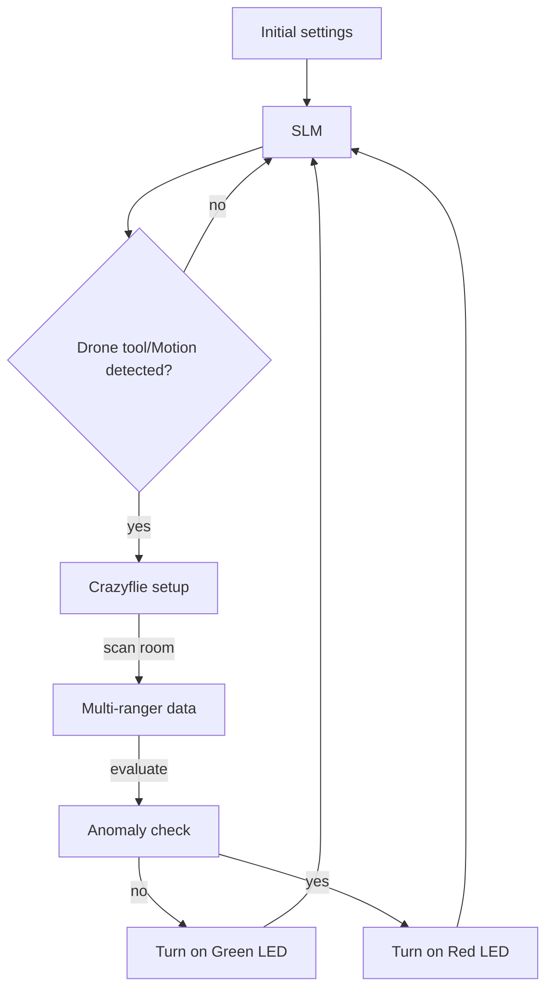

# Smart Inspection

Smart Inspection is an embedded edge‑AI project that performs indoor inspection using a Raspberry Pi 5, physical sensors and a Crazyflie 2.1 nano‑drone developed by Bitcraze.  
The system combines real‑time sensing, natural‑language interaction through a Small Language Model (SLM), and intelligent drone‑based scanning to detect and characterise potential anomalies in the environment.

The inspection pipeline starts with motion detection, may involve user interaction through the SLM, and, when requested, triggers a drone‑based scan using distance readings from the Multi‑ranger Deck.  
The codebase is written in Python, follows an object‑oriented design and was structured to be easy to extend with new sensors, actuators and behaviours.

<div align="center">

<a href="https://www.python.org" target="_blank" rel="noreferrer">  </a>   


</div>

---

## 1. System Architecture Overview

At a high level, the system is composed of four main layers:

1. **Sensors** – read motion and environmental data from the physical world.  
2. **Actuators** – provide feedback (LEDs) and controls for the Crazyflie drone.  
3. **SLM Layer** – runs a local language model and handles natural‑language interaction and function‑calling.  
4. **Orchestration** – coordinates sensors, actuators and SLM to implement the inspection logic based on the .

Each of these layers is implemented in a dedicated module and organised in classes, described below.

---

## 2. Sensors Module (`sensors/`)

All sensors are defined in `sensors/sensors.py`.

### 2.1 `Sensor` (abstract base class)

The `Sensor` class defines a common interface and basic behaviour for all concrete sensors.  
Typical responsibilities include:

- storing configuration parameters (GPIO pin, I²C address, etc.)  
- handling low‑level setup and initialisation  
- exposing a `get_data()`‑style method that returns the current measurement in a consistent format  
- providing error handling so that the rest of the system can work with safe, predictable data

All other sensor classes inherit from this base class and not all sensors are used in the specific theme of this project, but they were implemented for other possible applications within the context.

### 2.2 `PIRMotionDetector`

The `PIRMotionDetector` represents the passive infrared motion sensor used to detect movement in the environment.  
Its main role is:

- monitoring for motion events  
- informing the orchestration layer when motion is present  
- acting as the first trigger for starting an inspection flow

### 2.3 `BMP280`

The `BMP280` class encapsulates a Bosch BMP280 temperature and pressure sensor.  
Common applications:

- read ambient temperature  
- read atmospheric pressure  
- provide additional environmental context that can be logged and later queried via the SLM

### 2.4 `DHT22`

The `DHT22` class handles a DHT22 temperature and humidity sensor.  
It is typically used to:

- measure room temperature  
- measure relative humidity  
- feed these values into the inspection logs and natural‑language responses

### 2.5 `ButtonSensor`

The `ButtonSensor` abstracts a simple GPIO push‑button.  
It can be used for:

- manual overrides (e.g., start/stop inspection)  
- acknowledgment or reset actions, depending on the use case

### 2.6 `MultirangerSensor`

The `MultirangerSensor` communicates with the Crazyflie Multi‑ranger Deck and collects distance measurements.  
It provides:

- distance readings in multiple directions (front, back, left, right, up)  
- a compact representation of the surrounding space that is later used by the anomaly‑detection logic and by the SLM when the user asks about the environment

---

## 3. Actuators Module (`actuators/`)

Actuators are defined in the `actuators/` folder.

### 3.1 `BasicActuators` (LED control)

The `BasicActuators` class centralises LED handling.  
It typically exposes simple operations to:

- turn on the **green LED** when the environment is considered normal  
- turn on the **red LED** when an anomaly is detected  
- switch LEDs off when the system is idle or resetting  

This provides a quick, visual indication of the current inspection status.

### 3.2 `CrazyflieActuator` (drone interface)

The `CrazyflieActuator` class is responsible for interacting with the Crazyflie nano‑drone.  
Its responsibilities usually include:

- configuring and opening the radio link (Crazyradio)  
- safely taking off, flying short patterns and landing, according to the project’s constraints  
- coordinating with the Multi‑ranger Deck to read distance data during the inspection  
- exposing high‑level methods that the orchestration layer can call to “perform an inspection” without dealing with low‑level drone commands

The exact flight pattern (for example, yaw rotations to scan the surroundings) is implemented inside this class, so that the rest of the system only needs to request an inspection, not control each motor directly.

---

## 4. SLM Module (`slm/`)

The SLM layer lives in the `slm/` directory and integrates a local Small Language Model using Ollama.

### 4.1 `SLMConfig`

`SLMConfig` is responsible for initialising and configuring the language model.  
Among its typical responsibilities:

- selecting and loading the model (in this project, `llama3.2:3b`) via the Ollama runtime  
- defining the system prompt that sets the behaviour of the assistant (for example, how it should respond and which language to use)  
- maintaining an internal list of tools/functions that can be exposed to the model through function‑calling  
- providing a method (for example, `run_inference(...)`) that receives a prompt and, optionally, a set of tools and returns the model’s response

This class hides the details of how requests are sent to Ollama and how responses are parsed.

### 4.2 `InteractivityHandler`

`InteractivityHandler` focuses on user interaction and prompt management.  
Its responsibilities typically include:

- formatting user messages and context into a prompt that is suitable for the SLM  
- formatting responses display structure to provide a clean vision to user 
- parsing the structured (JSON‑like) responses returned by the SLM, especially when function‑calling is involved, so that the correct actions can be executed by the orchestration layer

In practice, this class is the “bridge” between free‑form natural‑language input and structured commands that the rest of the system can execute.

---

## 5. Main Orchestration (`smart_inspection.py`)

### 5.1 `SmartInspection`

The `SmartInspection` class is the central coordinator of the project.  
It wires together sensors, actuators and the SLM layer into a coherent inspection loop.

Typical responsibilities:

- creating and initialising sensor objects (PIR, environmental sensors, Multi‑ranger, etc.)  
- creating and initialising actuator objects (LEDs and Crazyflie drone)  
- initialising the SLM configuration and the `InteractivityHandler`  
- implementing the main application loop, which can be summarised as:

  1. **User interaction** – allow the user to ask questions or explicitly request a drone inspection. User controls everything in the application through natural language. 
  2. **Monitoring phase** –  if requested for the user, read the motion sensor (and possibly other sensors).  
  3. **Trigger** – when motion is detected, asks the user if he wnats to trigger an inspection.  
  4. **Drone inspection** – if an inspection is requested (either automatically or by the user), call the appropriate method to execute the inspection routine and collect Multi‑ranger data.  
  5. **Evaluation and feedback** – analyse the distance data and other sensor readings, infer whether there is an anomaly and update the LEDs accordingly (green or red). 

By concentrating orchestration logic in a single class, the project remains easier to understand, debug and extend.

---

## 6. Data Flow Diagram

The following diagram summarises the logical flow of data and decisions in the system:



---

## 7. Physical Setup

The following image register the pyshical setup used in this project. It can be seen in it the Raspberry PI 5 connections, the sensors, the crazyradio used in the drone communication and the Crazyflie drone.
Furthermore, the Raspberry PI 5 is equipped with a heat sink, a case and a fan. This is because applications with SLMs use a lot of the device's processing power, activating the 4 cores of the Rasberry PI completely at the moment the model thinks, which can cause overheating.


</br>
</br>

The pinout connections can be checked in the following tables: 
<table>
<tr>
<td valign="top">
<table>
<thead>
<tr><th colspan="2">Motion Sensor HC-SR501</th></tr>
<tr><th>Sensor PIN</th><th>Raspberry PIN</th></tr>
</thead>
<tbody>
<tr><td>5V</td><td>PIN 2 (5V)</td></tr>
<tr><td>GND</td><td>PIN 6 (Ground)</td></tr>
<tr><td>TTL output</td><td>PIN 7 (GPCLK0)</td></tr>
</tbody>
</table>
</td>

<td width="24"></td>

<td valign="top">
<table>
<thead>
<tr><th colspan="2">LEDs Actuators</th></tr>
<tr><th>LEDs</th><th>Raspberry PIN</th></tr>
</thead>
<tbody>
<tr><td>Red</td><td>PIN 33 (GPIO13)</td></tr>
<tr><td>Green</td><td>PIN 37 (GPIO26)</td></tr>
<tr><td>Yellow</td><td>PIN 35 (GPIO19)</td></tr>
</tbody>
</table>
</td>
</tr>
</table>


## 8. Installation and Execution

### 8.1 Requirements

- Raspberry Pi 5 (64‑bit OS recommended)  
- Python 3.9+  
- Crazyflie 2.1 with Flow Deck V2 and Multi‑ranger Deck  
- Crazyradio PA  
- Ollama installed and configured to run the `llama3.2:3b` model locally  

Python dependencies are listed in `requirements.txt`. A typical setup on the Raspberry Pi is:

```bash
python3 -m venv venv
source venv/bin/activate
pip install -r requirements.txt
```

### 8.2 Running the System

From the project directory, run:

```bash
python3 smart_inspection.py
```

During execution, user queries that mention **“drone”**, **“fly”** or **“crazyflie”** will allow the SLM to route the request to the Crazyflie inspection tool, enabling a natural‑language trigger for drone‑based inspection.

---

## 9. Repository Structure

```text
project/
│
├── actuators/
│   ├── basic_actuators.py      
│   └── crazyflie.py            
│
├── sensors/
│   └── sensors.py              
│
├── slm/
│   ├── interactivity_handler.py
│   └── slm_config.py          
│
└── smart_inspection.py         
└── create_dataset.py 
```

---

## 10. Demonstrative Video and Reports
A demonstrative video can be watched on YouTube on Professor Marcelo Rovai's channel. First, in the video, there is an explanation of the development process and a final demonstration with the execution of the model and an example of inspection carried out by the drone.

[](https://www.youtube.com/watch?v=_fR4MlWrTJw&t=1s)

Furthermore, the report submitted to the subject teacher with more information and details about the project can be checked [here](https://github.com/Eduard0Castro/smart_inspection/docs/smart_inspection_report.pdf).

## 11. Acknowledgments

The codebase was inspired by scripts provided by Professor Marcelo Rovai in the course **Machine Learning and System Engineering**.  
Reference link: *https://github.com/Mjrovai/UNIFEI-IESTI05-EDGE_AI.git*


---

## 12. Author

**This project was developed by Eduardo Castro at Universidade Federal de Itajubá (UNIFEI), 2025.**